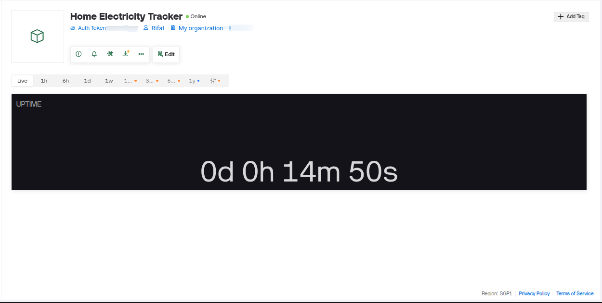
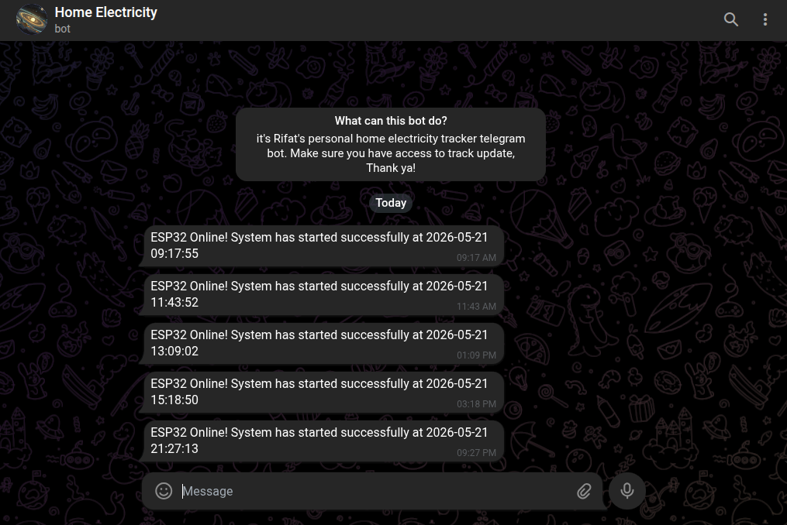

# ESP Home Electricity Tracker

## Project Overview
This project is an ESP32-based home electricity tracker designed to help you monitor the status of your home electricity remotely. It leverages Blynk for real-time status updates and Telegram for instant notifications, so you always know when your electricity is back—even if you’re not at home.

## Motivation & Story
For several months, my area has been experiencing massive load shedding. This has severely impacted my productivity, as I often leave home during outages and never know when the electricity returns. Many times, I return home only to find that the power was restored long ago, or it goes out again just as I sit down to work or study.

To solve this, I decided to build an ESP-based tracker. With this device, I can:
- Instantly know when my home electricity is back, even if I’m outside
- Track the ESP’s online/offline status and uptime via Blynk
- Receive a Telegram message with the exact time the ESP comes online

This project aims to illuminate my productivity by keeping me informed about my home’s electricity status, no matter where I am.

## Images

## Features
- **Blynk Integration:** View ESP online/offline status and uptime in real-time
- **Telegram Notification:** Get a message with the timestamp whenever the ESP comes online
- **Automatic Uptime Tracking:** Uptime is sent to Blynk every minute
- **Time Synchronization:** Uses NTP servers to get accurate time for notifications

## How It Works
- The ESP32 connects to your WiFi and Blynk account
- On startup, it sends a Telegram message with the current time, indicating that electricity (and WiFi) is back
- It updates its uptime on Blynk every minute
- If the ESP goes offline (due to power loss), you’ll see it in Blynk and won’t receive Telegram messages until power is restored

## Getting Started
1. **Hardware:**
	- ESP32 development board
	- WiFi connection
2. **Software:**
	- [Blynk](https://blynk.io/) account and app
	- Telegram bot and chat ID
	- Arduino IDE with required libraries
3. **Configuration:**
	- Set your WiFi credentials, Blynk Auth Token, Telegram Bot Token, and Chat ID in the code

## Code Highlights
- Sends Telegram message on boot with timestamp
- Tracks and displays uptime on Blynk (V0)
- Uses NTP for accurate time

## Author’s Note
This project was born out of necessity due to ongoing load shedding and the need to stay productive. I hope it helps others facing similar challenges!

---

Feel free to reach out for improvements or suggestions.
